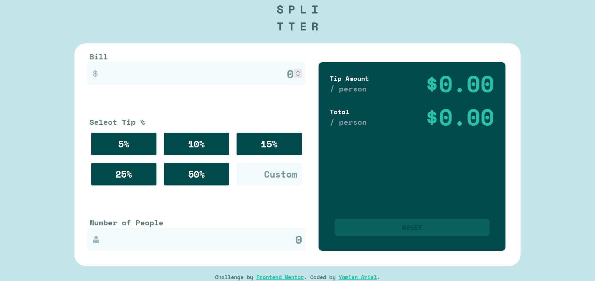

# Frontend Mentor - Tip calculator app solution

This is a solution to the [Tip calculator app challenge on Frontend Mentor](https://www.frontendmentor.io/challenges/tip-calculator-app-ugJNGbJUX). Frontend Mentor challenges help you improve your coding skills by building realistic projects.

## Table of contents

- [Overview](#overview)
  - [The challenge](#the-challenge)
  - [Screenshot](#screenshot)
  - [Links](#links)
- [My process](#my-process)
  - [Built with](#built-with)
  - [What I learned](#what-i-learned)
  - [Continued development](#continued-development)
  - [Useful resources](#useful-resources)
- [Author](#author)

## Overview

### The challenge

Users should be able to:

- View the optimal layout for the app depending on their device's screen size
- See hover states for all interactive elements on the page
- Calculate the correct tip and total cost of the bill per person

### Screenshot




### Links

- Solution URL: [GitHub](https://github.com/ariel172/Tip-calculator-app)
- Live Site URL: [Vercel](https://tip-calculator-app-ariel.vercel.app/)

## My process

### Built with

- Semantic **HTML5** markup  
- **SCSS** with modular architecture using `@use`  
- **Flexbox** and **CSS Grid** for layout  
- **Mobile-first workflow**  
- **Vanilla JavaScript** – no framework  
- Reusable, pure functions for DOM manipulation and calculation  
- Clear state handling (`disabled`, `hover`, `focus`, `error`)  
- **BEM-style** CSS naming convention (adapted in French)

### What I learned

## 📚 What I learned

This project helped me deepen my understanding of **DOM manipulation**, **function decomposition**, and the importance of keeping code **DRY** (Don't Repeat Yourself).  
I learned to separate concerns by creating **small reusable functions** for logic, validation, and updates.

One of the main improvements was the creation of this reusable validation function:

```js
function verifierChamp(elementInput, valeur, afficherErreur = null) {
  const estValide = !isNaN(valeur) && valeur > 0;
  elementInput.classList.toggle("erreur-input", !estValide);
  if (afficherErreur) {
    afficherErreur.classList.toggle("active", !estValide);
  }
  return estValide;
}
I also learned how to dynamically toggle a button's state using data-driven logic:
function mettreAJourEtatBoutonReset() {
  const actif = auMoinsUnChampRempli();
  inputReset.disabled = !actif;
  inputReset.classList.toggle("actif", actif);
}
This helped me structure my JavaScript in a more modular and readable way.

In CSS, I practiced mobile-first design and media queries to build responsive layouts.
I also made use of SCSS modules to separate components and avoid clutter.
// Example of a component-focused SCSS structure
.formulaire {
  .champ-prix {
    display: flex;
    flex-direction: column;
    .prix.erreur-input {
      border: 2px solid #FF4500;
    }
  }
}
Overall, this challenge reinforced the importance of clean structure, refactoring early, and progressive enhancement.
```

### 🔄 Continued development

As I continue to learn and build more projects, I want to focus on... :

- **Form validation**: I'd like to improve the way I handle validation errors for different types of input, including accessibility (ARIA roles, focus management).
- **State management**: While this project doesn't require complex state, I want to better understand how to cleanly manage shared state, especially in React or when scaling vanilla JavaScript applications.
- Advanced responsive design**: I want to improve and better manage breakpoints for tablets and ultra-wide screens.
- Testing JavaScript logic**: I've seen how useful reusable functions can be. In future projects, I want to learn how to write unit tests for logic like `verifierChamp()` and `calculerPourboire()`.

These areas will help me write more robust, accessible and scalable web applications.


### 📚 Useful resources

- [OpenClassrooms Web Courses](https://openclassrooms.com) – I applied what I learned from courses like *"Create dynamic web pages with JavaScript"* and *"Manage code with Git and GitHub"* which helped me structure my code and follow good practices.
- [Frontend Mentor README and design files] – These provided a clear UI structure and requirements that guided me through the project from layout to behavior.
- [ChatGPT by OpenAI](https://chat.openai.com) – I used AI support to clarify concepts I wasn't sure.

These resources were essential to help me make informed decisions and stay confident as I built the app.

## Author

- Website - [Yamien Ariel](https://github.com/ariel172)
- Frontend Mentor - [@ariel172](https://www.frontendmentor.io/profile/ariel172)
- CodePen - [@yamienariel](https://codepen.io/yamienariel)
